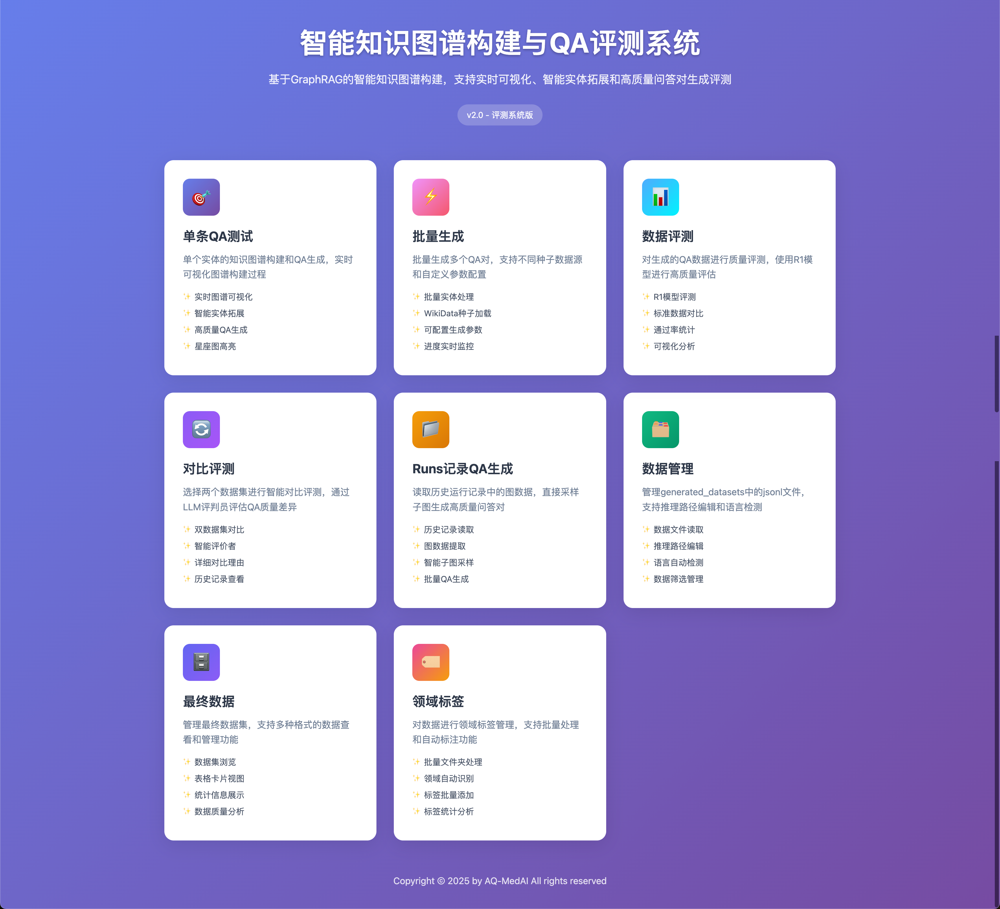

# MedResearcher-R1: Knowledge-Informed Trajectory Synthesis Approach

<div align="center">
  
</div>

<p align="center">
｜🤗 <a href="https://huggingface.co/AQ-MedAI/MedResearcher-R1-32B" target="_blank">HuggingFace Model</a> ｜
📄 <a href="https://arxiv.org/abs/2508.14880" target="_blank">arXiv</a> ｜
</p>


<!-- <p align="center">
  <a href="#">
    
  </a>
  <a href="#">
    
  </a>
</p> -->


**MedResearcher-R1** is a comprehensive **training data generation and synthesis framework** that tackles the challenge of domain-specific AI reasoning through **knowledge-informed trajectory synthesis**. Our framework provides an end-to-end solution for generating high-quality training data, consisting of three integrated components:

**🧠 Knowledge Graph Construction**: Our core innovation - an intelligent knowledge graph construction and QA synthesis system that transforms domain knowledge into high-quality question-answer pairs with automated reasoning path generation. This module serves as the foundation for creating domain-specific training data.



**🔄 Trajectory Generation Pipeline**: End-to-end trajectory synthesis and optimization system that converts QA pairs into multi-turn reasoning trajectories with tool interactions and quality filtering for model training.

**📊 Evaluation Pipeline**: Comprehensive model evaluation and validation framework for assessing reasoning performance across multiple benchmarks and validating the quality of synthesized training data.

These three components form a complete **training data production pipeline** from knowledge extraction to model training data generation and evaluation, enabling the creation of specialized reasoning models for domain-specific applications.


## Features
- **Knowledge Graph Construction**
  - **Interface Support**: Interactive web visualization with D3.js force-directed graphs
  - **Advanced Sampling Algorithms**: 5 sophisticated strategies (mixed, augmented_chain, community_core_path, dual_core_bridge, max_chain) for complex subgraph extraction
  - **Unified QA Generation**: Deep concept obfuscation with quantitative reasoning and multi-paradigm question synthesis
  - **Reasoning Path Generation**: Automated cheat_sheet creation with detailed step-by-step reasoning guidance for complex multi-hop questions
  - **Batch Processing System**: Concurrent QA generation with intelligent QPS control, progress monitoring, and resume capability

- **Trajectory Generation Pipeline**
  - **Agent Framework**: Multi-turn reasoning with tool integration and concurrent task processing
  - **Advanced Quality Filtering**: Token-based validation, tool call/response matching, and automated error detection
  - **Intelligent Rewriting System**: LLM-powered trajectory optimization with Masked Trajectory Guidance (MTG)

- **Evaluation Pipeline**
  - **Interactive Question Reasoning**: Single question mode with detailed step-by-step process visualization
  - **Batch Dataset Evaluation**: Multi-worker parallel processing with configurable rollouts and timeout controls

## Performance Highlights

Using our knowledge-informed trajectory synthesis framework, we developed **MedResearcher-R1**, a specialized reasoning model that demonstrates exceptional performance across multiple challenging benchmarks including MedBrowseComp, GAIA, and XBench-DeepSearch.


## Open-Sourced Dataset

We have open-sourced a high-quality QA dataset constructed through our KnowledgeGraphConstruction module. The dataset is available at [`TrajectoryGenerationPipeline/qa_data/open_data.jsonl`](TrajectoryGenerationPipeline/qa_data/open_data.jsonl) and contains:

- **Complex reasoning question-answer pairs** generated using our graph method
- **Detailed step-by-step reasoning paths** for each question, providing comprehensive problem-solving guidance
- **Multi-hop reasoning challenges** requiring deep understanding and logical inference

## News

- [2025.8] 🎉 Our framework for generating qa and trajectory for training is officially released!

## Links

- [Features](#features)
- [Performance Highlights](#performance-highlights)
- [Open-Sourced Dataset](#open-sourced-dataset)
- [Installation](#installation)
- [Quick start](#quick-start)
- [Citations](#citations)

## Installation

### MedResearcher-R1 environment

> **Note: This project requires Python version >= 3.10. Please ensure your environment meets this requirement.**

#### Using venv
```bash
# create venv
python -m venv .venv
source .venv/bin/activate
# install requirements
pip install -r requirements.txt
```

#### Using conda
```bash
# create conda environment with specified Python version
conda create -n med_researcher python=3.10

# activate environment
conda activate med_researcher

# install requirements
pip install -r requirements.txt
```

## Quick start

Train a domain-specific reasoning agent with knowledge-informed trajectory synthesis.

(1) setup environments
```bash
set -a
# fill your env in example
source env.example
set +a

```

(2) (optional) run graph web server and use our frontend to know how to generate qa and evaluate/filter the quality of generated qa
```bash
python KnowledgeGraphConstruction/start_web.py
```

Then you can use the frontend interface at http://localhost:5000. You can start with the Single QA Testing page to understand the generation process before running batch operations.

📖 **For detailed feature descriptions, please refer to**: [features-guide.md](./features-guide.md)

(3) use script to batch generate or use our provided dataset
```bash
cd KnowledgeGraphConstruction
# run batch generation - higher max-iterations will generate more complex question-answer pairs
python batch_qa_cli.py --seed-file demo_medical.csv --output ../TrajectoryGenerationPipeline/dataset/qa.jsonl --max-iterations 1

# alternatively, you can use our provided open-sourced dataset
# cp ../TrajectoryGenerationPipeline/qa_data/open_data.jsonl ../TrajectoryGenerationPipeline/dataset/qa.jsonl
```

(4) Launch trajectory generation and then postprocessing pipeline.

Configure the trajectory generation pipeline:

First, update `TrajectoryGenerationPipeline/src/trajectory_generation/config.json` with your model settings. You need to modify the following configuration parameters:

- `llm_config.api_key_env`: Environment variable name for your API key (you still need to set up the actual environment variable). Example: `API_KEY`
- `llm_config.api_base`: The API base URL of your model provider
- `generation.model`: The model name from your provider. For OpenRouter, you can check available model names at https://openrouter.ai/models
- `generation.dataset`: The dataset file in `TrajectoryGenerationPipeline/qa_data` directory (only accepts JSONL format). You can use our provided `open_data.jsonl` or generate your own dataset

**Important**: The read tool requires an OpenRouter API key. Either:
- Set your `OPENROUTER_API_KEY` environment variable, or  
- Modify the LLM client in `tools/tool_visit.py` (around line 73) to use your preferred API.

```bash
cd ../TrajectoryGenerationPipeline

python src/trajectory_generation/run_reasoning.py
python src/postprocessing/pipeline.py --input_dir generation/your_model_name/your_dataset 
--mode eval_filter
python src/postprocessing/pipeline.py --input_dir generation/your_model_name/your_dataset 
--mode rewrite
```

(5) Use the rewritten_results.jsonl for training

(6) When you finish the training of your model, you can evaluate the model by creating a server for the model via vllm or sglang
```bash
pip install sglang[all]
python -m sglang.launch_server --model-path /path/to/your/model --port 6001 --host 0.0.0.0 --mem-fraction-static 0.95 --tp-size 2
```

(7) Evaluate model performance using the Evaluation Pipeline

# Configure API keys in EvaluationPipeline/evaluation_config.json first:
# - llm.api_base: the API base URL of your model
# - llm.model: specify your model name (optional)
# - llm.api_key_env: environment variable name for your API key (optional)
```bash
cd ../EvaluationPipeline
# Run single question evaluation
python eval_cli.py --mode interactive

# Run batch dataset evaluation
python eval_cli.py --mode batch --dataset sample --workers 20
```

## Citations

```bibtex
@article{medresearcher2025,
  title={MedResearcher-R1: Expert-Level Medical Deep Researcher via A Knowledge-Informed Trajectory Synthesis Framework},
  author={\author{Ailing Yu, Lan Yao, Jingnan Liu, Zhe Chen, Jiajun Yin, Yuan Wang, Xinhao Liao,Zhiling Ye,Ji Li,Yun Yue,Hansong Xiao,Hualei Zhou,Chunxiao Guo,Peng Wei,Jinjie Gu},
  journal={arXiv preprint arXiv:https://arxiv.org/pdf/2508.14880},
  year={2025}
}
``` 